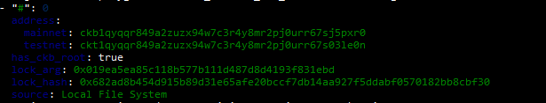
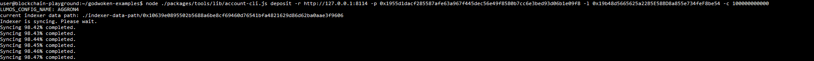
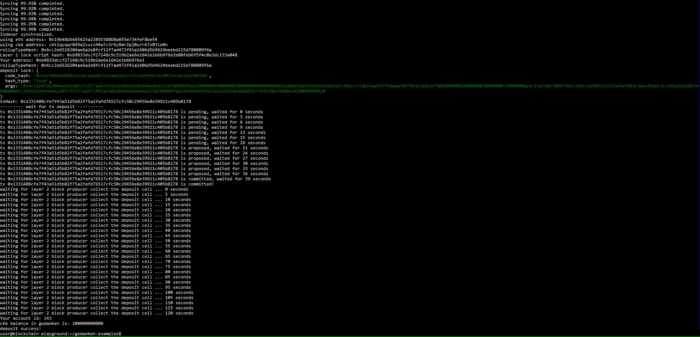

# Gitcoin Nervos Hackathon - Create A Godwoken Account On The EVM Layer 2 Testnet
## Task Submission

### A screenshot of the accounts you created (account list) in ckb-cli

### A link to the Layer 1 address you funded on the Testnet Explorer.
https://explorer.nervos.org/aggron/address/ckt1qyqqr849a2zuzx94w7c3r4y8mr2pj0urr67s03le0n

### A screenshot of the console output immediately after you have successfully submitted a deposit to Layer 2

